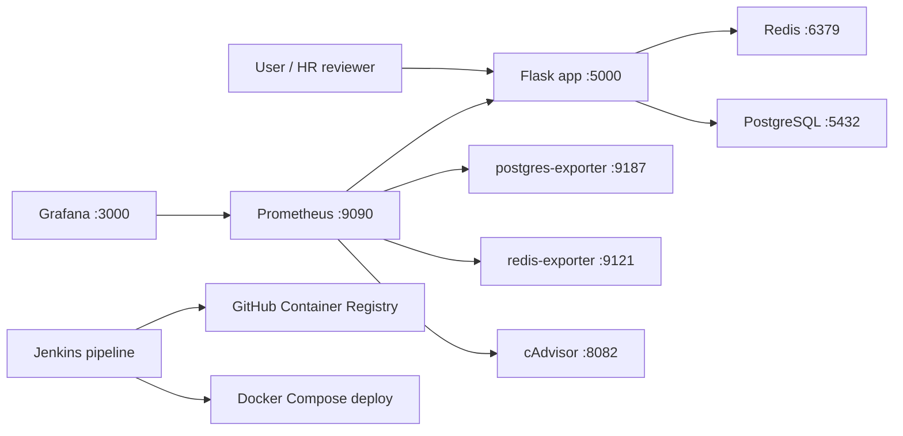

# DevOps Monitoring Demo

Небольшой pet-проект, который демонстрирует полный локальный DevOps-контур: контейнеризацию Flask-приложения, работу с PostgreSQL и Redis, сбор метрик Prometheus, визуализацию в Grafana и Jenkins pipeline для сборки, проверки и публикации Docker-образа в GitHub Container Registry.

## Что показывает проект

- Dockerfile для Python/Flask-приложения.
- Docker Compose окружение из приложения, PostgreSQL, Redis, Prometheus, Grafana и exporter-сервисов.
- Jenkins pipeline: checkout, build, smoke test, push image в GHCR, deploy через Compose и интеграционные проверки.
- Метрики приложения на `/metrics` и healthcheck на `/health`.
- Мониторинг PostgreSQL, Redis и Docker-контейнеров через exporters и cAdvisor.

## Архитектура



## Быстрый запуск

1. Скопировать пример переменных окружения:

```bash
cp .env.example .env
```

2. Запустить стек:

```bash
docker compose up -d --build
```

3. Проверить сервисы:

```bash
curl http://localhost:5000/
curl http://localhost:5000/health
curl http://localhost:5000/db
curl http://localhost:5000/redis
curl http://localhost:5000/metrics
```

## Доступные URL

| Сервис | URL |
| --- | --- |
| Flask app | http://localhost:5000 |
| Prometheus | http://localhost:9090 |
| Grafana | http://localhost:3000 |
| cAdvisor | http://localhost:8082 |
| PostgreSQL exporter | http://localhost:9187/metrics |
| Redis exporter | http://localhost:9121/metrics |

## Jenkins pipeline

Pipeline описан в `Jenkinsfile` и включает:

1. Checkout репозитория по SSH.
2. Сборку Docker-образа.
3. Smoke test контейнера.
4. Тегирование и публикацию образа в GHCR.
5. Запуск окружения через Docker Compose.
6. Интеграционные проверки приложения и мониторинга.
7. Остановку окружения и logout из registry.

Для работы pipeline в Jenkins нужны credentials:

| ID | Назначение |
| --- | --- |
| `github-ssh` | SSH key для checkout из GitHub |
| `github-ghcr` | GitHub username + token для push в GHCR |

Перед запуском pipeline указываются параметры:

| Параметр | Пример |
| --- | --- |
| `APP_NAME` | `my-app` |
| `GITHUB_OWNER` | `your-github-username` |
| `REPOSITORY_URL` | `git@github.com:your-github-username/my-app.git` |

## Переменные окружения

Секреты не хранятся в репозитории. Для локального запуска используется `.env`, пример находится в `.env.example`.

## Остановка

```bash
docker compose down
```

Чтобы удалить volumes с данными:

```bash
docker compose down -v
```

## Возможные улучшения

- Добавить автопровижининг Grafana dashboards.
- Добавить GitHub Actions как альтернативу Jenkins.
- Добавить unit tests для Flask routes.
- Вынести production deploy в отдельный compose-файл или Ansible role.
