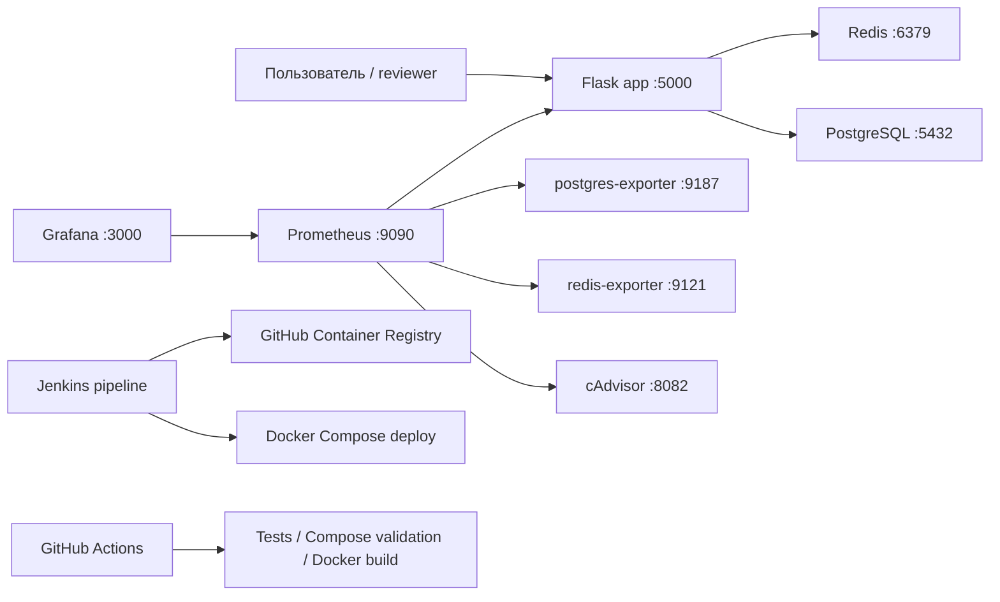

# DevOps Monitoring Demo

[](https://github.com/x2slow4u/my-app/actions/workflows/ci.yml)


Production-like pet project для демонстрации базовых DevOps-навыков: containerization, orchestration через Docker Compose, CI/CD, monitoring, metrics exporters, health checks и работа с секретами через environment variables.

## Что Демонстрирует Проект

- Containerized Python Flask application с Docker.
- Multi-service Docker Compose stack: PostgreSQL, Redis, Prometheus, Grafana, exporters и cAdvisor.
- Jenkins pipeline: checkout, image build, smoke test, push в GHCR, deploy через Compose и integration checks.
- GitHub Actions CI для automated tests, Compose validation и Docker image build.
- Prometheus metrics endpoint на `/metrics`.
- Health checks для приложения, PostgreSQL и Redis.
- Чистая структура репозитория без IDE-файлов и hardcoded production secrets.

## Tech Stack

| Область | Инструменты |
| --- | --- |
| Application | Python 3.10, Flask |
| Datastores | PostgreSQL, Redis |
| Containers | Docker, Docker Compose |
| CI/CD | Jenkins, GitHub Actions |
| Monitoring | Prometheus, Grafana, postgres-exporter, redis-exporter, cAdvisor |
| Testing | pytest |

## Архитектура



## Быстрый Старт

1. Скопировать environment variables:

```bash
cp .env.example .env
```

2. Запустить stack:

```bash
docker compose up -d --build
```

3. Проверить application endpoints:

```bash
curl http://localhost:5000/
curl http://localhost:5000/health
curl http://localhost:5000/db
curl http://localhost:5000/redis
curl http://localhost:5000/metrics
```

## URL Сервисов

| Сервис | URL |
| --- | --- |
| Flask app | http://localhost:5000 |
| Prometheus | http://localhost:9090 |
| Grafana | http://localhost:3000 |
| cAdvisor | http://localhost:8082 |
| PostgreSQL exporter | http://localhost:9187/metrics |
| Redis exporter | http://localhost:9121/metrics |

## Команды Для Разработки

```bash
make up       # build и запуск всех services
make down     # остановить services
make logs     # смотреть logs
make ps       # показать status services
make test     # запустить pytest
make check    # скомпилировать app.py и проверить docker compose
make clean    # остановить services и удалить volumes
```

Если `make` не установлен, команды из `Makefile` можно выполнять вручную.

## CI/CD

### GitHub Actions

Workflow в `.github/workflows/ci.yml` запускается при push и pull request в `main`:

1. Установка Python dependencies.
2. Запуск pytest.
3. Проверка Docker Compose configuration.
4. Сборка Docker image.

### Jenkins

`Jenkinsfile` содержит parameterized pipeline:

1. Checkout из GitHub по SSH.
2. Сборка Docker image.
3. Запуск smoke test.
4. Tag и push image в GitHub Container Registry.
5. Deploy через Docker Compose.
6. Integration checks для приложения и monitoring services.
7. Остановка test environment и logout из registry.

Необходимые Jenkins credentials:

| ID | Назначение |
| --- | --- |
| `github-ssh` | SSH key для GitHub checkout |
| `github-ghcr` | GitHub username и token для GHCR push |

Параметры pipeline:

| Параметр | Пример |
| --- | --- |
| `APP_NAME` | `my-app` |
| `GITHUB_OWNER` | `x2slow4u` |
| `REPOSITORY_URL` | `git@github.com:x2slow4u/my-app.git` |

## Environment Variables

Секреты не хранятся в репозитории. Локальные значения загружаются из `.env`; безопасный шаблон находится в `.env.example`.

| Variable | Default | Назначение |
| --- | --- | --- |
| `ENV` | `production` | Application environment |
| `POSTGRES_DB` | `app` | PostgreSQL database |
| `POSTGRES_USER` | `app` | PostgreSQL user |
| `POSTGRES_PASSWORD` | `change_me` | PostgreSQL password для local demo |
| `GRAFANA_ADMIN_PASSWORD` | `change_me` | Grafana admin password для local demo |

## Скриншоты

Screenshots можно добавить после запуска stack:

```text
docs/images/app-health.png
docs/images/prometheus-targets.png
docs/images/grafana-dashboard.png
docs/images/jenkins-pipeline.png
```

## Остановка И Очистка

```bash
docker compose down
```

Также можно удалить volumes:

```bash
docker compose down -v
```

## Roadmap

- Добавить Grafana datasource и dashboard provisioning.
- Добавить Prometheus alert rules и Alertmanager.
- Добавить image vulnerability scanning через Trivy.
- Добавить Kubernetes manifests или Helm chart.
- Добавить Ansible playbook для VM bootstrap.
