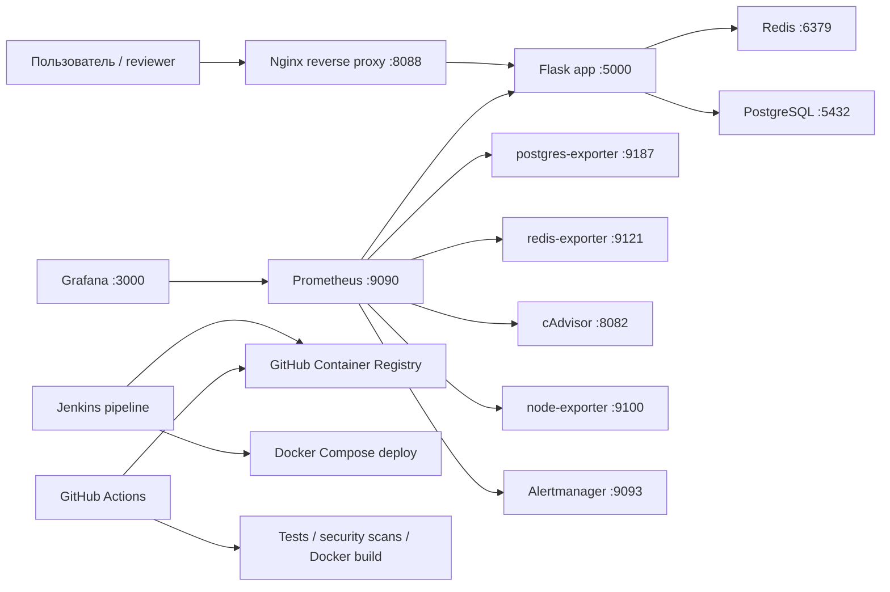
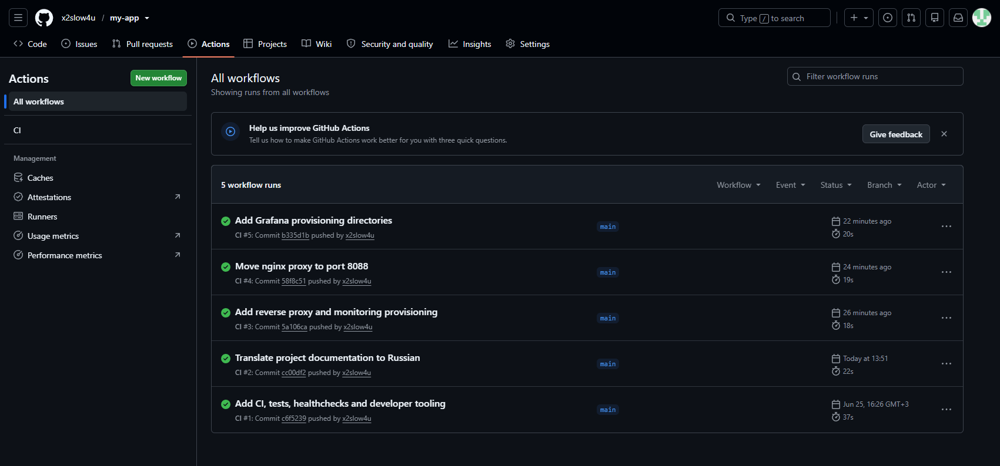
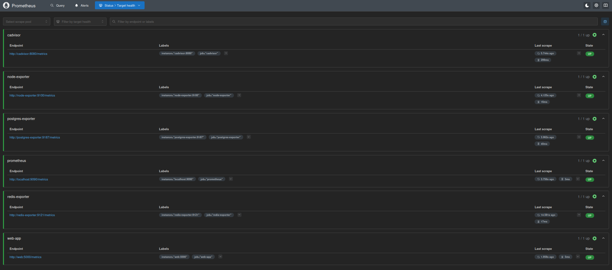
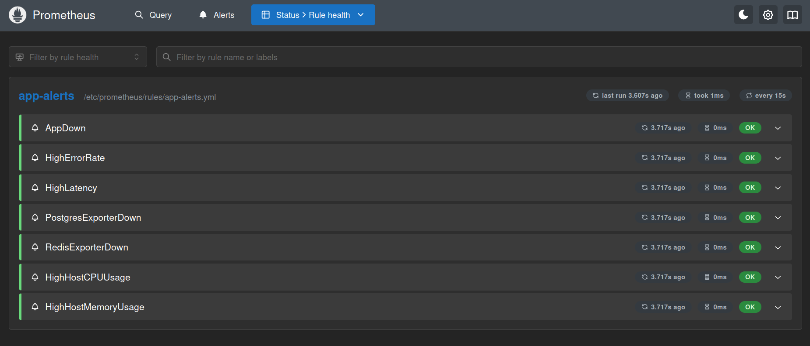
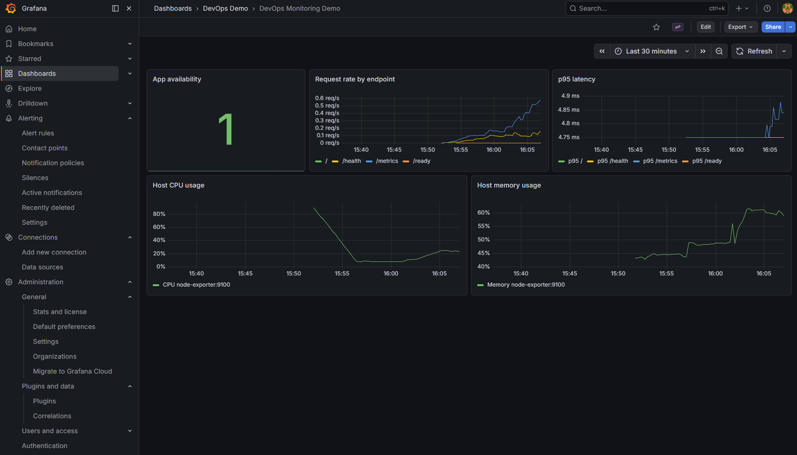
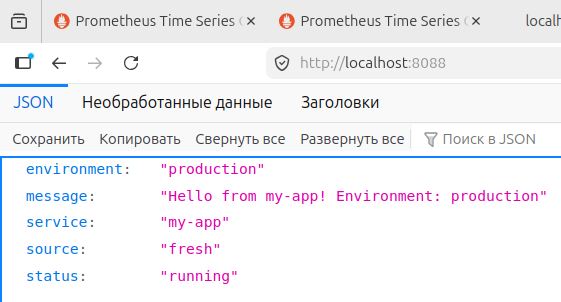

# DevOps Monitoring Demo

[](https://github.com/x2slow4u/my-app/actions/workflows/ci.yml)


Production-like pet project для демонстрации DevOps-навыков: Docker, Docker Compose, Nginx reverse proxy, PostgreSQL, Redis, CI/CD, Prometheus, Alertmanager, Grafana, exporters, alerts, health checks и operational docs.

## Что Демонстрирует Проект

- Containerized Python Flask application с Docker и gunicorn.
- Multi-service Docker Compose stack: Nginx, Flask app, PostgreSQL, Redis, Prometheus, Alertmanager, Grafana, exporters, cAdvisor и node-exporter.
- Nginx reverse proxy перед приложением.
- GitHub Actions CI: pytest, Docker Compose validation и Docker image build.
- DevSecOps checks: Hadolint, pip-audit и Trivy image scan.
- Runtime image hardening: build tooling (`pip`, `setuptools`, `wheel`) удаляется после установки dependencies.
- Artifact publishing: Docker image публикуется в GitHub Container Registry после успешных tests и security checks.
- Jenkins pipeline: checkout, image build, smoke test, GHCR push, deploy через Compose и integration checks.
- Prometheus metrics endpoint на `/metrics`.
- Application metrics: request count, status code labels и latency histogram.
- Health checks для приложения, PostgreSQL, Redis и Nginx.
- Grafana datasource и dashboard provisioning из репозитория.
- Prometheus alert rules для availability, error rate, latency, CPU и RAM.
- Alertmanager route для grouping, deduplication и notification receiver.
- Docs: architecture, runbook, alerts и troubleshooting.

## Tech Stack

| Область | Инструменты |
| --- | --- |
| Application | Python 3.10, Flask, gunicorn |
| Datastores | PostgreSQL, Redis |
| Reverse proxy | Nginx |
| Containers | Docker, Docker Compose |
| CI/CD | Jenkins, GitHub Actions |
| Monitoring | Prometheus, Alertmanager, Grafana, postgres-exporter, redis-exporter, cAdvisor, node-exporter |
| Testing | pytest |

## Архитектура



Подробнее: [docs/architecture.md](docs/architecture.md)

## Быстрый Старт

1. Скопировать environment variables:

```bash
cp .env.example .env
```

2. Запустить stack:

```bash
docker compose up -d --build
```

3. Проверить endpoints:

```bash
curl http://localhost:8088/nginx-health
curl http://localhost:5000/health
curl http://localhost:5000/ready
curl http://localhost:5000/db
curl http://localhost:5000/redis
curl http://localhost:5000/metrics
```

## URL Сервисов

| Сервис | URL |
| --- | --- |
| Nginx reverse proxy | http://localhost:8088 |
| Flask app | http://localhost:5000 |
| Prometheus | http://localhost:9090 |
| Alertmanager | http://localhost:9093 |
| Grafana | http://localhost:3000 |
| cAdvisor | http://localhost:8082 |
| Node Exporter | http://localhost:9100/metrics |
| PostgreSQL exporter | http://localhost:9187/metrics |
| Redis exporter | http://localhost:9121/metrics |

## Monitoring И Alerts

Prometheus config находится в `docker/prometheus/prometheus.yml`.

Alert rules находятся в `docker/prometheus/rules/app-alerts.yml`.

Alertmanager config находится в `docker/alertmanager/alertmanager.yml`.

Grafana provisioning:

```text
docker/grafana/provisioning/
docker/grafana/dashboards/
```

После запуска stack Grafana автоматически получает Prometheus datasource и dashboard `DevOps Monitoring Demo`.

Документация:

- [docs/alerts.md](docs/alerts.md)
- [docs/runbook.md](docs/runbook.md)
- [docs/troubleshooting.md](docs/troubleshooting.md)

## Команды Для Разработки

```bash
make up       # build и запуск всех services
make down     # остановить services
make logs     # смотреть logs
make ps       # показать status services
make test     # запустить pytest
make check    # скомпилировать app.py и проверить docker compose
make clean    # остановить services и удалить volumes
```

Если `make` не установлен, команды из `Makefile` можно выполнять вручную.

## CI/CD

### GitHub Actions

Workflow в `.github/workflows/ci.yml` запускается при push и pull request в `main`:

1. Установка Python dependencies.
2. Запуск pytest.
3. Проверка Python dependencies через `pip-audit`.
4. Проверка Docker Compose configuration.
5. Проверка Dockerfile через `Hadolint`.
6. Сборка Docker image.
7. Trivy scan Docker image на HIGH/CRITICAL vulnerabilities.
8. Publish Docker image в GitHub Container Registry при push в `main`.

Published image:

```text
ghcr.io/x2slow4u/my-app:latest
ghcr.io/x2slow4u/my-app:<commit-sha>
```

Подробнее: [docs/security.md](docs/security.md)

### Jenkins

`Jenkinsfile` содержит parameterized pipeline:

1. Checkout из GitHub по SSH.
2. Сборка Docker image.
3. Запуск smoke test.
4. Tag и push image в GitHub Container Registry.
5. Deploy через Docker Compose.
6. Integration checks для приложения и monitoring services.
7. Остановка test environment и logout из registry.

Необходимые Jenkins credentials:

| ID | Назначение |
| --- | --- |
| `github-ssh` | SSH key для GitHub checkout |
| `github-ghcr` | GitHub username и token для GHCR push |

## Environment Variables

Секреты не хранятся в репозитории. Локальные значения загружаются из `.env`; безопасный шаблон находится в `.env.example`.

| Variable | Default | Назначение |
| --- | --- | --- |
| `ENV` | `production` | Application environment |
| `POSTGRES_DB` | `app` | PostgreSQL database |
| `POSTGRES_USER` | `app` | PostgreSQL user |
| `POSTGRES_PASSWORD` | `change_me` | PostgreSQL password для local demo |
| `GRAFANA_ADMIN_PASSWORD` | `change_me` | Grafana admin password для local demo |

## Скриншоты

Проект проверен на VM. Ниже screenshots, которые показывают, что CI/CD, monitoring, alerts, Grafana provisioning и Nginx reverse proxy реально работают.

### GitHub Actions



### Prometheus Targets



### Prometheus Rules



### Grafana Dashboard



### Nginx App



## Остановка И Очистка

```bash
docker compose down
```

Также можно удалить volumes:

```bash
docker compose down -v
```
