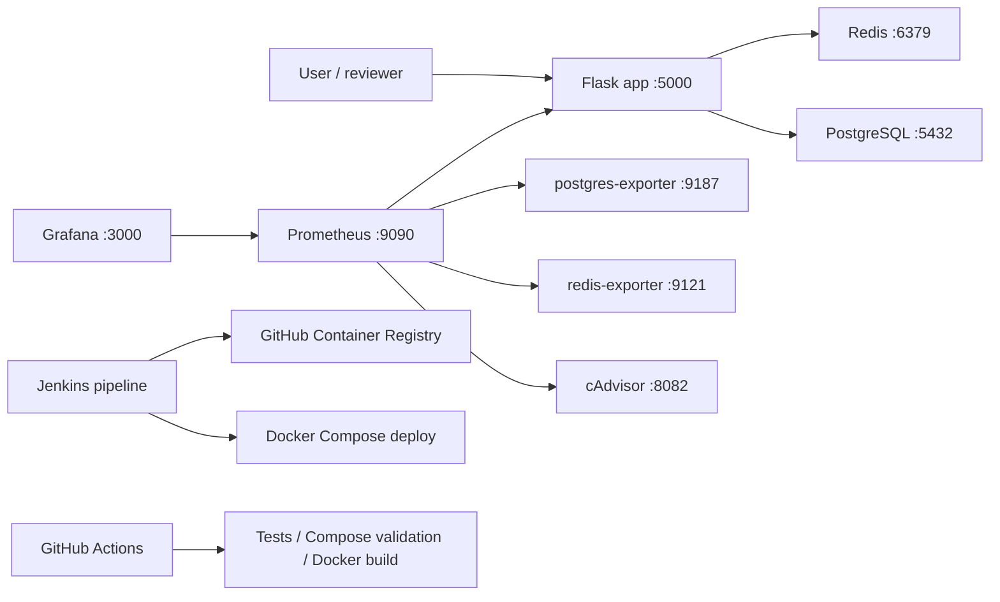

# DevOps Monitoring Demo

[](https://github.com/x2slow4u/my-app/actions/workflows/ci.yml)


Production-like pet project for demonstrating core DevOps skills: containerization, service orchestration, CI/CD, monitoring, metrics exporters, health checks, and secret handling through environment variables.

## What This Project Demonstrates

- Containerized Python Flask application with Docker.
- Multi-service Docker Compose stack with PostgreSQL, Redis, Prometheus, Grafana, exporters, and cAdvisor.
- Jenkins pipeline for checkout, image build, smoke test, GHCR push, Compose deploy, and integration checks.
- GitHub Actions CI for automated tests, Compose validation, and Docker image build.
- Prometheus metrics endpoint at `/metrics`.
- Application, PostgreSQL, and Redis health checks.
- Clean repository structure without IDE files or hardcoded production secrets.

## Tech Stack

| Area | Tools |
| --- | --- |
| Application | Python 3.10, Flask |
| Datastores | PostgreSQL, Redis |
| Containers | Docker, Docker Compose |
| CI/CD | Jenkins, GitHub Actions |
| Monitoring | Prometheus, Grafana, postgres-exporter, redis-exporter, cAdvisor |
| Testing | pytest |

## Architecture



## Quick Start

1. Copy environment variables:

```bash
cp .env.example .env
```

2. Start the stack:

```bash
docker compose up -d --build
```

3. Check application endpoints:

```bash
curl http://localhost:5000/
curl http://localhost:5000/health
curl http://localhost:5000/db
curl http://localhost:5000/redis
curl http://localhost:5000/metrics
```

## Service URLs

| Service | URL |
| --- | --- |
| Flask app | http://localhost:5000 |
| Prometheus | http://localhost:9090 |
| Grafana | http://localhost:3000 |
| cAdvisor | http://localhost:8082 |
| PostgreSQL exporter | http://localhost:9187/metrics |
| Redis exporter | http://localhost:9121/metrics |

## Developer Commands

```bash
make up       # build and start all services
make down     # stop services
make logs     # follow logs
make ps       # show service status
make test     # run pytest
make check    # compile app.py and validate docker compose
make clean    # stop services and remove volumes
```

If `make` is not installed, use the commands from the `Makefile` directly.

## CI/CD

### GitHub Actions

The workflow in `.github/workflows/ci.yml` runs on pushes and pull requests to `main`:

1. Install Python dependencies.
2. Run pytest.
3. Validate Docker Compose configuration.
4. Build the Docker image.

### Jenkins

The `Jenkinsfile` contains a parameterized pipeline:

1. Checkout from GitHub over SSH.
2. Build Docker image.
3. Run a smoke test.
4. Tag and push the image to GitHub Container Registry.
5. Deploy with Docker Compose.
6. Run integration checks for the app and monitoring services.
7. Stop the test environment and log out from the registry.

Required Jenkins credentials:

| ID | Purpose |
| --- | --- |
| `github-ssh` | SSH key for GitHub checkout |
| `github-ghcr` | GitHub username and token for GHCR push |

Pipeline parameters:

| Parameter | Example |
| --- | --- |
| `APP_NAME` | `my-app` |
| `GITHUB_OWNER` | `x2slow4u` |
| `REPOSITORY_URL` | `git@github.com:x2slow4u/my-app.git` |

## Environment Variables

Secrets are not stored in the repository. Local values are loaded from `.env`; the safe template is in `.env.example`.

| Variable | Default | Purpose |
| --- | --- | --- |
| `ENV` | `production` | Application environment |
| `POSTGRES_DB` | `app` | PostgreSQL database |
| `POSTGRES_USER` | `app` | PostgreSQL user |
| `POSTGRES_PASSWORD` | `change_me` | PostgreSQL password for local demo |
| `GRAFANA_ADMIN_PASSWORD` | `change_me` | Grafana admin password for local demo |

## Screenshots

Screenshots can be added after running the stack:

```text
docs/images/app-health.png
docs/images/prometheus-targets.png
docs/images/grafana-dashboard.png
docs/images/jenkins-pipeline.png
```

## Stop And Clean Up

```bash
docker compose down
```

Remove volumes as well:

```bash
docker compose down -v
```

## Roadmap

- Add Grafana datasource and dashboard provisioning.
- Add Prometheus alert rules and Alertmanager.
- Add image vulnerability scanning with Trivy.
- Add Kubernetes manifests or a Helm chart.
- Add Ansible playbook for VM bootstrap.
