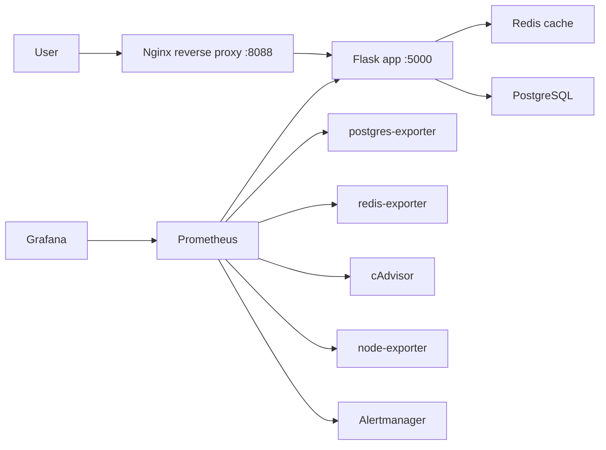

# Архитектура

Проект демонстрирует production-like окружение для небольшого Flask-сервиса: приложение, база данных, кеш, reverse proxy, monitoring stack, exporters и CI/CD.

## Сервисы

| Сервис | Назначение | Порт |
| --- | --- | --- |
| `nginx` | Reverse proxy перед Flask app | `8088 -> 80` |
| `web` | Flask application с `/health`, `/ready`, `/metrics` | `5000` |
| `db` | PostgreSQL database | internal `5432` |
| `redis` | Redis cache | internal `6379` |
| `prometheus` | Metrics collection и alert rules | `9090` |
| `alertmanager` | Alert routing, grouping и deduplication | `9093` |
| `grafana` | Dashboards и visualization | `3000` |
| `postgres-exporter` | PostgreSQL metrics | `9187` |
| `redis-exporter` | Redis metrics | `9121` |
| `cadvisor` | Container metrics | `8082` |
| `node-exporter` | Host metrics: CPU, RAM, disk, filesystem | `9100` |

## Поток Запроса

## Monitoring

Prometheus собирает:

- availability приложения через `up{job="web-app"}`;
- request rate через `app_http_requests_total`;
- latency через `app_http_request_duration_seconds`;
- PostgreSQL metrics через `postgres-exporter`;
- Redis metrics через `redis-exporter`;
- container metrics через `cAdvisor`;
- host metrics через `node-exporter`.

Grafana автоматически получает Prometheus datasource и dashboard из `docker/grafana/provisioning`.

Alertmanager получает firing alerts от Prometheus и применяет routing/grouping policy из `docker/alertmanager/alertmanager.yml`.
